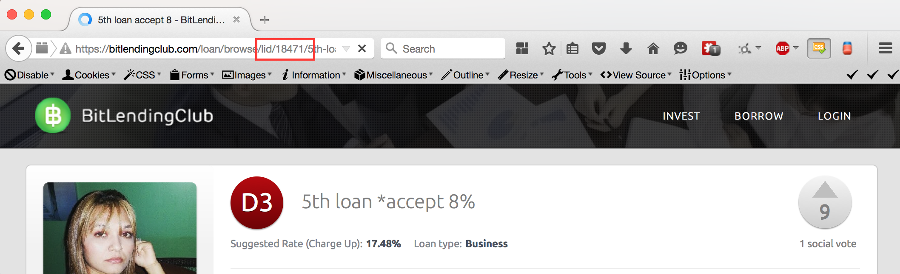
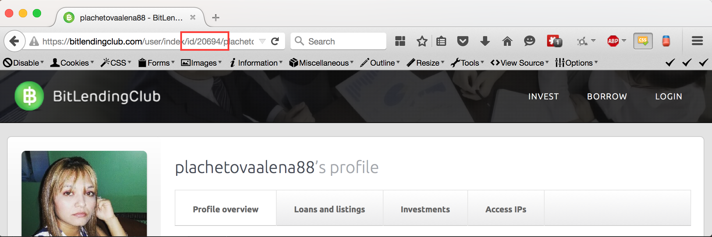

Installation
============

First, DO NOT MOVE ANY OF THE FILES RELATIVELY. Everything needs to stay in the same relative position in order for the
 script to run. The exceptions to this rule are any files that are specified in ruleConfig.json (e.g. the log file)

Unzip the given BLCScript.zip file in the folder you want. I'm going to use the absolute path `/blc/script` as my
'root folder' (the folder where BLCScript.zip was unzipped)

First, open up the ruleConfig.json file and find:

```
    "to": [
      "trentonmaki@gmail.com"
    ]
```

Change it to:
```
    "to": [
      "trentonmaki@gmail.com",
      "[YOUR EMAIL ADDRESS]"
    ]
```

don't forget the comma after "trentonmaki@gmail.com", the " around [YOUR EMAIL ADDRESS], or to replace
[YOUR EMAIL ADDRESS] with your email address

Next, run the php file environmentCheck.php. Normally, this would be done by SSHing into the server, navigating to the
 directory and then running the command `php environmentCheck.php`

If something goes wrong, and your environment isn't setup to run the script, then there will be red text describing the
 problem and possible solutions. If you can't get your environment to work, call your developer and have them help you set
 it up

Now you need to read through `The Config File` and then configure your application. This is where you set the script
 to track certain borrowers, make certain manual investments, set the amount to automatically invest in reputation
 loans, and set install your API key.

Now it's time to set up the cron job. Here is a script you can use from the command line, though using CPanel's interface
 or some other cron like service should work just as well. Don't forget to replace the path with the absolute path to
 TheScript.php.

 NOTE: This script sets the cron job to run as often as possible, and that might be a strain on your server.
 I suggest modifying the `* * * * *` to the timing you want (say, every half hour?) look here for more information on
 making cron jobs: http://code.tutsplus.com/tutorials/scheduling-tasks-with-cron-jobs--net-8800

`(crontab -l ; echo "* * * * * /blc/script/TheScript.php") | crontab`


A note about the `data/` directory
===================================

The file `ruleConfig.json` in `src/data/` is THE configuration file. It has the list of rules
 to follow, it configures the email client, and it has global configuration information.
 The file is written in a format called JSON. Almost all options optional, and sensible
 defaults will almost always be used for general settings.

The file `data.json` in `src/data` is the cache file. TheScript uses this to remember which investments
 it's already made, and what investments it needs to run the algorithm on. DO NOT TOUCH THIS FILE. It's
 only for the computers and it's format is not designed for human usage.

JSON Tutorial
==============

JSON is a very simple format. It's markup consists of ",{}, [], : and \\. Here's how you write
 some text (like in this document) in JSON:

 `"This is ordinary text that the computer will read as if it where text"`

Note the "". Those double quotes tell the computer to read everything in between them as
 strings. String is the programmer word for text, and I'll be using it throughout this document
 and in the tools I've built.

There are a few more types of data in JSON: numbers, objects, and lists.

Numbers are exactly as you might expect:

 `3.14`

 `42`

Numbers can be any number written in decimal notation with any amount of numbers (any precision)
 after the '.'

Lists are just that, lists; though sometimes they're called 'arrays'. They can contain any kind of value, even other
 lists:


```
 [
  "Some text",
  99,
  [
   "Lists inside lists",
   [
    "inside lists...",
    {}
   ]
  ]
 ]`
```

Lists need to have every element (item in the list) separated by ',' and they need to start with '[' and end with ']'.
Lists are good for holding collections of data, for example the names
 of people you've met:

 `["Bob", "Susan","Frank", "Mary"]`

Grocery lists:

 `["Egss", "Milk", "Cheese"]`

And any other kind of list.

The last kind of data in JSON is objects. Objects allow you to create relationships between information
 and they're an essential part of JSON. A phone book is a good example of an object:

```
{
 "Susan": "1 (800) 123-4567",
 "Bob": "1 (800) 765-4321",
 "Arin": "1 (800) 102-9384"
}
```

This is a JSON object that relates names to phone numbers. You can (programmatically)
 ask this object 'Get me the phone number for Susan' and you would get '1 (800) 123-4567'
 in response. In JSON terms, the names are the *keys* and the phone numbers are the *values*.
 Keys must be a string or a number, but values can be anything, lists, numbers, strings, even other objects!

Note the ':' in between the key and the value. This tells the computer that the string on the left
 is a key, and the string on the right is a value. This is required when creating an object. There's
 also a ',' at the end of lines 2 and 3. This is also required and it separates different pairs of
 keys and values; except at the end, where it's unneeded (as there are no more key:value pairs).

There's one more type of value that isn't in JSON, but it is used in the script. It's called Numeric and
 numeric types represent decimal numbers, either in string or number form. for example, 5 and "5" are
 both valid numeric values, and they both have the same numeric value.

You can read more about JSON on `http://json.org/` and
 `http://blog.scottlowe.org/2013/11/08/a-non-programmers-introduction-to-json/`. There are also many handy online
 editors for json that can help you see if you've created the right structure. I've preloaded one of these with
 the information from ruleConfig.json, check it out here:
 `http://www.jsoneditoronline.org/?id=580da57ebec4ded236ca50db32bbfd33`


The Config File
===============

NOTE: If you don't know how to read and edit JSON, look at JSON Tutorial first

The config file is structured as a large object, with each key either being set to a value, or being set
 to an object to define groups of options. Every key is optional EXCEPT for APIKey. This MUST be exist
 in order for the script to run.

Note that the configCheck script follows this specification strictly, and can be used to test valid config files
 But the parser that TheScript actually uses is much, much more forgiving and it replaces bad values with the defaults

The ruleConfig.json file has been filled almost entirely filled with default values, as well as a few example values in rules.

NOTE: All file paths are relative to the location of TheScript.php. Absolute paths are not supported

NOTE: key.key syntax is used to refer to nested keys, for example: `A.B is 1` refers to the JSON structure: {"A":{"B":1}}

NOTE: For manual investments and automatic borrowers, list items not matching the specification are removed from the list

* APIKey: REQUIRED, string - Used with the BitLendingClub API, see 'https://bitlendingclub.com/developers/index/auth' for how to get one
* scale: 5, OPTIONAL, numeric between 1 and 5, inclusive - Used to set the precision of TheScript from 1 (only 1 number after the '.') to 5 (5 numbers after the '.')
* version: -1 OPTIONAL, numeric - Used by the app to set the version of this config file. -1 means that the version is unknown. The current version of the config file is 1
* logFile: "data/log.log", OPTIONAL, string - The location of the data log file to write to
* logName: "BLC", OPTIONAL, string - The name of the log channel. You don't need to worry about this one, it's for developers
* cacheFile: "data/data.json", OPTIONAL, string - The location of the cache file that the script uses to keep track of investments
* email: {}, OPTIONAL, object - The object that holds all the information about emails.
* email.username: "appforgeorg@gmail.com", OPTIONAL, string - The username for logging into the SMTP (email) server. Defaults to a special account I made just for this
* email.password: "#6Mk1pXBxSymt%C5$LtvBNbUU*c4m^eJGIHqPvGAFljf%SuO$1&e$IOIaLdi0fZ0", OPTIONAL, string - The password for logging into the SMPTP (email) server. Defaults to the first password I set for the special account I made
* email.smtp:"smtp.gmail.com", OPTIONAL, string - The SMTP (email) server to connect to. Defaults to gmail.
* email.port:587, OPTIONAL, string - The port on the SMTP (email) server to connect to. Defaults to the TLS standard port 587
* email.security:"tls", OPTIONAL, string - The security mechanism used to connect with the SMTP (email) server. Defaults to TLS.
* email.sender: "appforgeorg@gmail.com", OPTIONAL, string - The sender of this email. This can be different than the SMTP username
* email.to: ["trentonmaki@gmail.com"], OPTIONAL, List of email addresses - The list of email addresses to send warning messages to when the script breaks down. My email is included by default but this can be changed
* rules: {}, OPTIONAL, object - The rules to use to find particular investments
* rules.automaticBorrowers: [], OPTIONAL List of objects - This is a list of the borrowers to automatically invest in. The rate is calculated based on the other investors in that investment
* rules.reputationBTCLoanAmount: 0, OPTIONAL, numeric >= 0 (greater than or equal to 0) - Every time a reputation loan is posted with a denomination of BTC, invest this amount. 0 deactivates this rule
* rules.manualInvestments: [], OPTIONAL, List of objects - Loans to manually invest in

Specification for the objects inside manual investment list:

* loanID: REQUIRED, numeric - The loan to invest in
* amount: REQUIRED, numeric - The amount to invest
* maxRate: OPTIONAL, numeric, defaults to 100 - The maximum rate, for the automatically calculated rate. The rate will never be allowed to go higher than this

Specification for objects inside the automatic borrowers list:

* borrowerId: REQUIRED, numeric - The borrower id to follow
* amount: REQUIRED, numeric - The amount to automatically invest when a new investment is found from this borrower

How to find IDs
===============

How do you find the appropriate loanIDs and borrowerIds to put into the config file? This is actually surprisingly easy.
First go the page of an investment you want and look at the URL bar. You should see a part of it that goes: /lid/[NUMBER].
Copy that number. That is the loanID.



(See file `Loan 18471.png` if the image doesn't load')

In this image the loanID is 18471

To find a borrowerId, go to that borrowers page and look at the URL bar again. This time you should se /id/[NUMBER].
This number is the borrowerId.



(See file `Borrower 20649.png` if the image doesn't load')

In this image, the borrowerId is 20649

Tools
=====

Three tools come bundled with this script, the first is checkConfig.php, which can be run with `php /path/to/checkConfig.php`,
to check the default config location, or with `php /path/to/checkConfig.php path/to/config.json`.
This parses the config file to find any errors, or data that doesn't match the spec. It
will print out the problems in red, or just a simple 'Config file is OK!'

checkFilePermissions is the second, it can also be run with `php /path/to/checkFilePermissions.php`. This file scans all
of the files in it's containing directory and determines if all the files can be opened and read that need to be. If
there are files with badly set permissions, it outputs the problem files and instructions for fixing all of the files
at the same time.

The final tool, environmentCheck.php, uses both of the previous tool and does some extra validation of your network
connection and SMTP connection. This file SHOULD NOT be run very often as it sends a test email to each of the
addresses in the 'to' field of the config file. This file also contains suggestions, for how to fix your environment,
But, due to the nature of the problem, it can't offer anything more actionable than suggestions.

Example daily usage
===================

Our subject is a man called Brian. Brian uses a mac or linux-based computer and knows just enough about the command line
and the JSON file format to be dangerous. He also has a FTP/FTPS client which he can use to send files to the server.

Brian has found several investments he wants to make and several more borrowers he wants to follow. He goes through the
web page for each loan and borrower and copies their IDs into a text file. Then he goes to `http://www.jsoneditoronline.org`,
and he uploads his local copy of `ruleConfig.json`. He makes his changes, checking that everything is OK with the editors
tools before saving the config file to `ruleConfigNEW.json`. He then boots up terminal and uses the `cd` command to
navigate to folder where he saved file and then `php checkConfig.php ruleConfigNEW.json`. He examines the output, fixes
any errors and then uploads the file to the server, replacing the old `ruleConfig.json` on the server. Finally, he
cleans up after himself by deleting the old `ruleConfig.json` and renaming `ruleConfigNEW.json` to `ruleConfig.json`

Some time later, Brian checks in on his investments. Everything is going well but the current batch of reputation
investments isn't right, he'd prefer to invest a bit higher in one, and a bit lower in a few others. He logs into
bitlendingclub.com account, finds and changes the related investments, then closes the browser window; safe in the
knowledge that everything is as it should be.


How the script works
====================

This script is separated into two halves: investment collection and investment creation/balancing (balancing is the
word I used for running the weighted average algorithm). Investment collection comes from three different sources:

 * The list of manual investments
 * Today's reputation and BTC loans
 * And the tracked borrower's latest loans

That third item hides is trickery because the BLC API doesn't allow you to get any information about users.
TheScript has to download the list of investments from today and then search through it to find any new loans that
have the given borrowerId.

All three of these rules run in parallel and they each add several Work Items into a queue. Each work item consists
of a loan Id, an amount to invest and an optional rate and max rate.

After all three are done running, we start to process all of these work items. TheScript uses the cache file in
data/data.json to keep track of which loans it has invested in (and therefore needs to balance), and which investments
it needs to create. Once all of these WorkItems have been processed, each of the network requests needed to fulfill
these tasks launches simultaneously.

Then the app shuts down and writes what it did to the log and cache files.